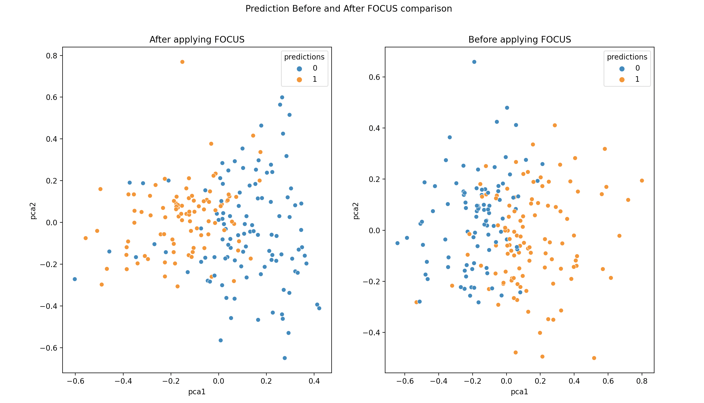

FOCUS: Flexible Optimizable Counterfactual Explanations for Tree Ensembles
==========================================================================

**Deployment & Documentation & Stats & License**

.. image:: https://img.shields.io/pypi/v/focus-cfe.svg?color=brightgreen
   :target: https://pypi.org/project/focus-cfe/
   :alt: PyPI version

.. image:: https://coveralls.io/repos/github/kyosek/focus-cfe/badge.svg
   :target: https://coveralls.io/github/kyosek/focus-cfe
   :alt: Coverage Status

.. image:: https://api.codeclimate.com/v1/badges/93840d29606abb212051/maintainability
   :target: https://codeclimate.com/github/kyosek/focus-cfe/maintainability
   :alt: Maintainability

-----

This library is an implementation of `FOCUS: Flexible Optimizable Counterfactual Explanations for Tree Ensembles <https://arxiv.org/abs/1911.12199>`_.

FOCUS generates optimal distance counterfactual explanations to the original data for all the instances in tree‐based machine learning models.

**FOCUS counterfactual explanation generation with 3 Lines of Code**\ :

.. code-block:: python

    from focus import Focus
    # Initialize Focus instance with default values
    focus = Focus()
    # Generate counterfactual explanations for given tree model and features
    pertubed = focus.generate(tree_model, X)

**Examples**\:

- More comprehensive example can be found in the `examples folder <https://github.com/kyosek/focus/blob/master/examples/focus_example.py>`_.
- Another example in a kaggle notebook can be found `here <https://www.kaggle.com/code/kyosukemorita/focus-cfe-example>`_.
- Below demonstrates the comparison of before and after FOCUS was applied to feature set from the above example.

**Note**\:

Currently FOCUS can be applied to scikit-learn `DecisionTreeClassifier`, `RandomForestClassifier` and `AdaBoostClassifier`.

Installation
^^^^^^^^^^^^

It is recommended to use **pip** or **conda** for installation. Please make sure
**the latest version** is installed:

.. code-block:: bash

   pip install focus-cfe            # normal install
   pip install --upgrade focus-cfe  # or update if needed

.. code-block:: bash

   conda install -c conda-forge focus-cfe
